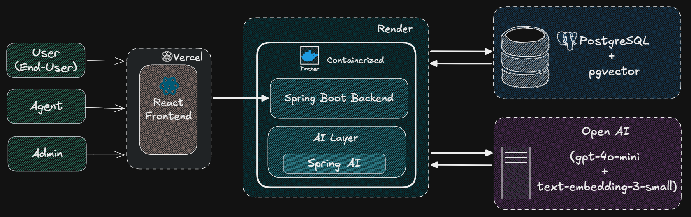
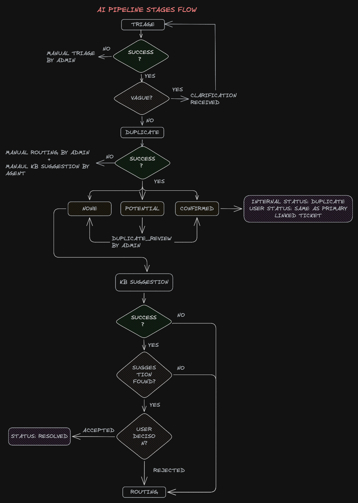
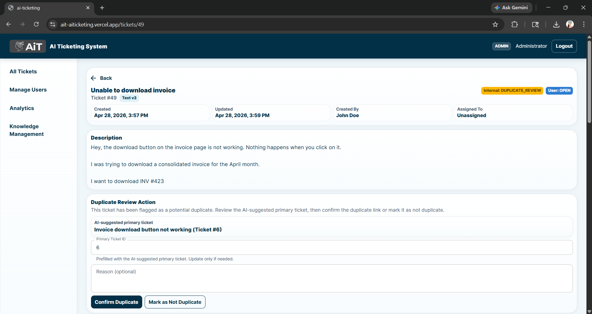
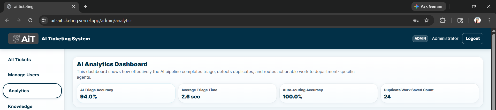
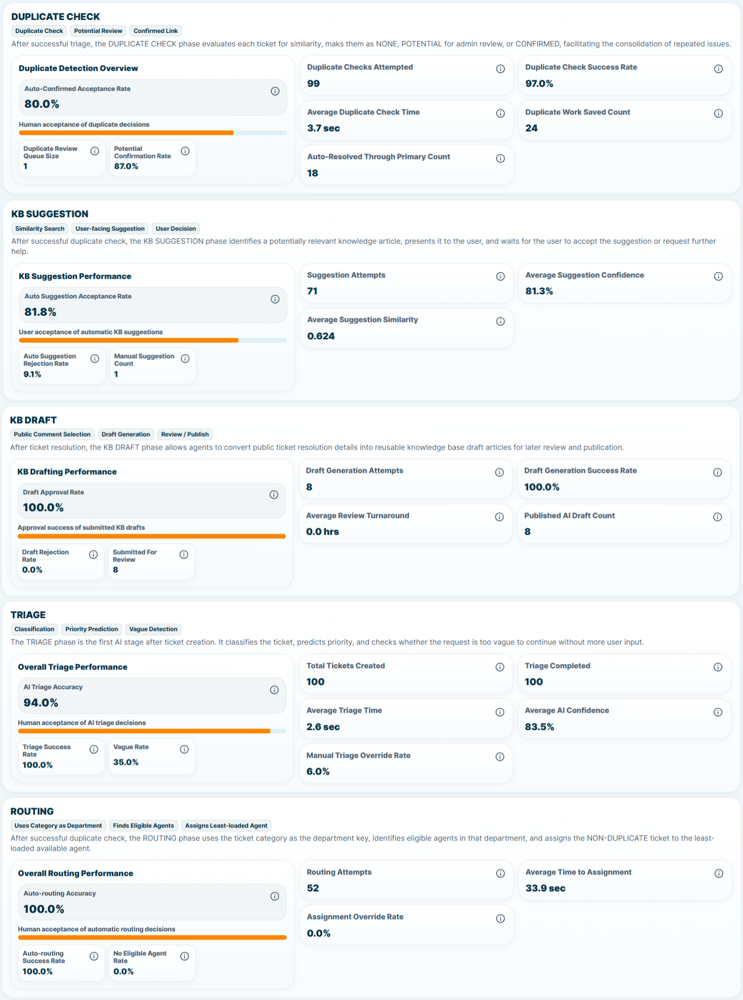

# AI-Powered Automated Ticket Management Platform

An enterprise-style IT Service Management (ITSM) system that uses AI to automate ticket triage, duplicate detection, knowledge base (KB) suggestions, routing, and post-resolution knowledge capture.

This project is designed as a **full-stack, production-oriented system**, focussing on:
- AI-assisted workflows  
- asynchronous processing  
- auditability and governance  
- role-based access control  
- analytics-driven evaluation  

---

## 🔗 Live Deployment

- **Frontend (Vercel):** https://ait-aiticketing.vercel.app
- **Backend Swagger API Docs (Render):** https://ait-aiticketing.onrender.com/swagger-ui/index.html  
- **Database:** PostgreSQL (Supabase)  

---

## 🎯 Project Purpose

This system demonstrates how AI can be integrated into ITSM workflows to:
- reduce manual triage effort  
- minimize duplicate work  
- enable self-service resolution  
- improve agent productivity  
- capture reusable knowledge post-resolution

It implements a **structured, multi-stage AI pipeline** with explainability, governance, and measurable outcomes.

---

## 🏗️ System Architecture




### Key Architectural Concepts
- **Transactional Outbox Pattern** for async AI execution  
- Separation of **Request Layer vs AI Processing Layer**  
- **Audit-first design** using `ai_decisions`  
- Resilient pipeline with retries and fallback logic

---

## ⚙️ AI Pipeline
Ticket Created
→ TRIAGE (classification + prioritization + vague detection)
→ DUPLICATE_CHECK (embedding similarity + LLM decision)
→ KB_SUGGESTION (self-resolution)
→ ROUTING (agent assignment)
→ Agent Resolution
→ KB_DRAFT (knowledge capture)



### Key Design Decisions
- KB Suggestion happens **before routing**  
- KB Drafting happens **after resolution**  
- Duplicate detection uses **two-threshold strategy (0.65 / 0.85)**  
- KB retrieval uses **low-threshold recall + LLM validation (0.5)**  
- Each stage is:
  - independently auditable  
  - retryable  
  - event-driven via `outbox_events` 

---

## 🚀 Core Features

### 👤 User
- Create and track tickets  
- Respod to vague clarifications
- View and accept/reject KB suggestions for self-resolution  

### 🧑‍💻 Agent
- Work on assigned tickets  
- Add public/internal comments  
- Suggest KB articles manually  
- Generate AI KB drafts from resolved tickets

### 🛠️ Admin
- Review duplicate tickets  
- Override AI decisions (controlled transitions for status, category, priority, routing, duplicates)  
- Manage KB lifecycle (draft → review → publish)  
- Access analytics dashboard 

---

## 🖥️ Ticket Details (AI Workflow)


## 🤖 AI Decision Example



## 📊 Analytics Dashboard




## 🤖 AI Features

### 1. Triage
- Categorizes ticket into predefined departments  
- Assigns priority  
- Detects vague tickets and requests clarification  
- Controlled vague loop with max clarification rounds  

### 2. Duplicate Detection
- Uses embedding similarity + LLM validation  
- Classifies as NONE / POTENTIAL / CONFIRMED  
- Admin review for potential duplicates  
- Prevents duplicate work and redundant routing  

### 3. KB Suggestion
- Retrieves top-K KBs using pgvector  
- LLM re-ranks and decides suggestion  
- User can accept or reject  
- Enables self-resolution before routing
- Agent fallback via manual suggestion  

### 4. Routing
- Assigns tickets to agents based on category  
- Tracks assignment accuracy and overrides  

### 5. KB Drafting (Knowledge Capture)
- Generates KB drafts from resolved tickets  
- Uses agent-selected PUBLIC comments  
- Agent edits and submits  
- Admin approval workflow  
- Approved drafts become published KBs  

---

## 📊 Analytics & Evaluation

The system provides stage-wise metrics:

- **Triage:** AI triage accuracy, vague rate, average processing time  
- **Routing:** auto-routing accuracy, assignment latency, override rate  
- **Duplicate Detection:** duplicate confirmation rate, work saved via duplicate linking  
- **KB Suggestion:** acceptance/rejection rates, manual vs AI suggestion comparison  
- **KB Drafting:** draft generation success rate, approval/rejection rates, review turnaround time, published AI drafts  

---

## 🗄️ Database Design

Core tables:

- `tickets`  
- `ticket_text_versions`  
- `ticket_comments`  
- `outbox_events`  
- `ai_decisions`  
- `ticket_duplicate_links`  
- `kb_articles`  
- `kb_embeddings`  
- `kb_suggestions`  
- `admin_overrides`  
- `refresh_tokens`  

---

## 🔐 Security

- JWT authentication (access + refresh tokens)
- Role-based access control (USER, AGENT, ADMIN)  
- Endpoint-level authorization  

---

## 🖥️ Frontend

- React + TypeScript + Material UI  
- Role-based navigation  
- Structured ticket detail UI with AI stage visibility  
- Polling for:
  - comments  
  - pipeline updates

---

## ⚙️ Backend

- Java 17 + Spring Boot  
- Spring Security (JWT)  
- Spring Data JPA  
- JDBC Template for analytics  
- Spring AI integration  
- Transactional Outbox Pattern  
- Retry + failure handling  
- Swagger/OpenAPI  

---

## 🐳 Deployment

- **Backend:** Dockerized, deployed on Render  
- **Frontend:** Vercel  
- **Database:** Supabase (PostgreSQL + pgvector)

---

## 📁 Repository Structure
/backend -> Spring Boot backend
/frontend -> React frontend
/database -> SQL schema file
/docs -> diagrams


---

## 🧪 Local Development

### Backend
```bash
cd backend
./mvnw spring-boot:run
```

### Frontend
```bash
cd frontend
npm install
npm run dev
```

## 🔑 Environment Variables

### Backend (Render)
```bash
DB_URL
DB_USERNAME
DB_PASSWORD
JWT_SECRET
FRONTEND_URL
OPENAI_API_KEY
```

### Frontend
```bash
VITE_API_BASE_URL
```

## 📘 API Documentation
```bash
https://ait-aiticketing.onrender.com/swagger-ui/index.html
```

## 🎓 Summary
This project demonstrates:

- AI-driven workflow automation
- event-driven system design
- explainable AI decision-making
- full-stack cloud deployment
- analytics-driven evaluation

It goes beyond a typical CRUD application by integrating AI pipelines, asynchronous processing, and measurable system impact.